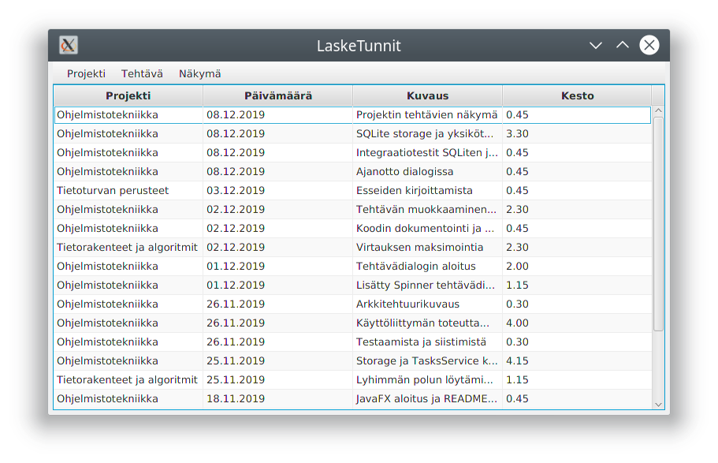

# LaskeTunnit

Sovelluksen avulla käyttäjä voi pitää (esimerkiksi Ohjemistotekniikka-kurssilla vaadittua) työaikakirjanpitoa.

Sovellukseen on mahdollistaa toteuttaa tuki erilaisille tiedostomuodoille tai muille tallennusratkaisuille. Aluksi ohjelma tukee työaikakirjanpidon tallentamista markdown-muotoon ja sqlite-tietokantaan.



## Dokumentaatio

- [Käyttöohje](dokumentointi/kayttoohje/index.md)
- [Vaatimusmäärittely](dokumentointi/vaatimusmaarittely.md)
- [Arkkitehtuurikuvaus](dokumentointi/arkkitehtuuri.md)
- [Työaikakirjanpito](dokumentointi/tuntikirjanpito.md)
- [Testausdokumentti](dokumentointi/testaus.md)

## Release

- [Viikko 6](https://github.com/artoh/ot-harjoitustyo/releases/tag/v0.6)

## Komentorivitoiminnot

### Ohjelman suorittaminen

```
mvn compile exec:java -Dexec.mainClass=artoh.lasketunnit.ui.LaskeTunnitApplication
```

### Testaus

Testien suorittaminen

**Älä koskaan, missään tapauksessa, ikinä aja testejä root-oikeuksilla!!!** Osa testeistä käyttää /tmp-hakemistoa, ja ne on suunniteltu ajettavaksi Linux-järjestelmässä.


```
mvn test
```

Testikattavuusraportin luominen
```
mvn jacoco:report
```
Kattavuusraporttia voi tarkastella avaamalla selaimella tiedosto target/site/jacoco/index.html


### JavaDoc
JavaDoc generoidaan komennolla

```
mvn javadoc:javadoc
```
JavaDocia voi tarkastella avaamalla selaimella tiedosto target/site/apidocs/index.html

### Checkstyle

Tiedostoon [checkstyle.xml](https://github.com/artoh/ot-harjoitustyo/blob/master/LaskeTunnit/checkstyle.xml) määrittelemät tarkistukset suoritetaan komennolla

```
mvn jxr:jxr checkstyle:checkstyle
```

Mahdolliset virheilmoitukset selviävät avaamalla selaimella tiedosto target/site/checkstyle.html
