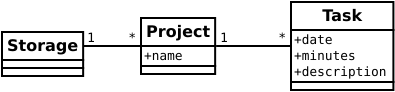
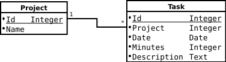
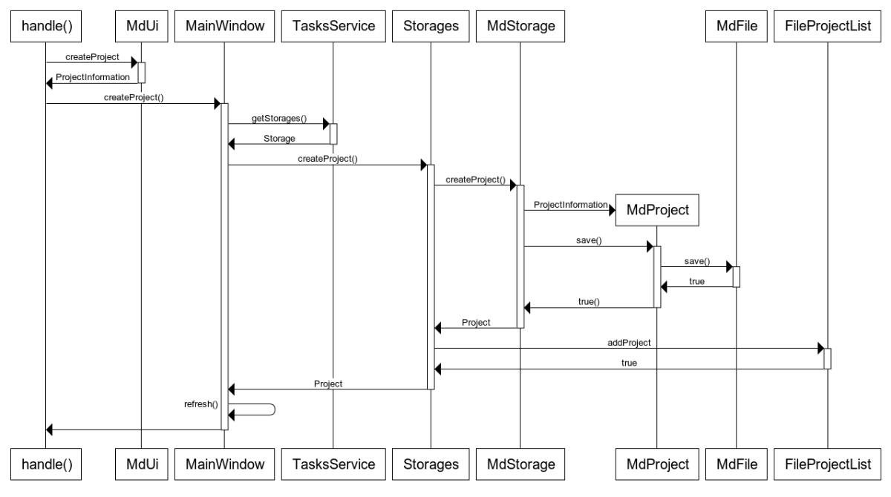

# Arkkitehtuurikuvaus

## Rakenne


[**lasketunnit.md**](https://github.com/artoh/ot-harjoitustyo/tree/v1.0/LaskeTunnit/src/main/java/artoh/lasketunnit/md) toteuttaa tuntikirjanpidon tallennuksen md-muodossa siten, että [**lasketunnit.md.storage**](https://github.com/artoh/ot-harjoitustyo/tree/v1.0/LaskeTunnit/src/main/java/artoh/lasketunnit/md/storage) toteuttaa tiedostoon tallentamisen ja tiedostosta lukemisen ja [**lasketunnit.md.ui**](https://github.com/artoh/ot-harjoitustyo/tree/v1.0/LaskeTunnit/src/main/java/artoh/lasketunnit/md/ui) tallennusjärjestelmästä riippuvaisen osan käyttöliittymästä (tiedoston valitsemisen). Vastaavalla tavalla [**lasketunnit.sqlite**](https://github.com/artoh/ot-harjoitustyo/tree/v1.0/LaskeTunnit/src/main/java/artoh/lasketunnit/sqlite) toteuttaa tallennukset SQLite-tietokantaan.

[**lasketunnit.ui**](https://github.com/artoh/ot-harjoitustyo/tree/v1.0/LaskeTunnit/src/main/java/artoh/lasketunnit/ui) toteuttaa JavaFX-käyttöliittymän.

[**lasketunnit.service**](https://github.com/artoh/ot-harjoitustyo/tree/v1.0/LaskeTunnit/src/main/java/artoh/lasketunnit/service) toteuttaa ohjelmalogiikan ja [**lasketunnit.storage**](https://github.com/artoh/ot-harjoitustyo/tree/v1.0/LaskeTunnit/src/main/java/artoh/lasketunnit/storage) tarjoaa ohjelmalogiikalle yksinkertaisen rajapinnan tiedon pysyväissäilytykseen. Projektien luetteloiden tallentaminen on toteutettu [**lasketunnit.projectlist**](https://github.com/artoh/ot-harjoitustyo/tree/v1.0/LaskeTunnit/src/main/java/artoh/lasketunnit/projectlist) -pakkaukseen.

## Sovelluslogiikka

Sovelluksen loogisen datamallin muodostavat rajapinnat Storage, Project ja Task:



- [**Storage**](https://github.com/artoh/ot-harjoitustyo/blob/v1.0/LaskeTunnit/src/main/java/artoh/lasketunnit/storage/Storage.java) kuvaa yhtä tallennukset taustajärjestelmää
- [**Project**](https://github.com/artoh/ot-harjoitustyo/blob/v1.0/LaskeTunnit/src/main/java/artoh/lasketunnit/service/Project.java) kuvaa yhtä projektia
- [**Task**](https://github.com/artoh/ot-harjoitustyo/blob/v1.0/LaskeTunnit/src/main/java/artoh/lasketunnit/service/Task.java) kuvaa projektin yhtä tehtävää

[**ProjectInformation**](https://github.com/artoh/ot-harjoitustyo/blob/v1.0/LaskeTunnit/src/main/java/artoh/lasketunnit/service/ProjectInformation.java) kuvaa niitä projektin parametreja, joilla sen tallentaminen voidaan määritellä. Näitä ovat

 - Projektista käyttäjälle näytettävä nimi
 - Tallennusjärjestelmän tunnus (**md** tai **sqlite**)
 - Merkkijono, jolla tallennusjärjestelmä määrittelee tallennustavan (md-tiedostoilla tiedostonnimi ja sqlite-tietokannassa projektin id-tunnus)

Luokan tehtävänä on yhdistää projektien käsittely eri komponenteissa tavalla, joka on mahdollisimman riippumaton toteutuksesta.

[**TasksService**](https://github.com/artoh/ot-harjoitustyo/blob/v1.0/LaskeTunnit/src/main/java/artoh/lasketunnit/service/TasksService.java)-luokan tehtävänä on yhdessä [**Storages**](https://github.com/artoh/ot-harjoitustyo/blob/v1.0/LaskeTunnit/src/main/java/artoh/lasketunnit/storage/Storages.java)-luokan kanssa tarjota käyttöliittymälle yksinkertainen rajapinta.

### Injektointi ja rekisteröinti

Pakkaukset injektoidaan [LaskeTunnitApplication](https://github.com/artoh/ot-harjoitustyo/blob/v1.0/LaskeTunnit/src/main/java/artoh/lasketunnit/ui/LaskeTunnitApplication.java)-luokassa olevissa konstruktoreissa

```java
ProjectList projectList = new FileProjectList("lasketunnit.ini");
storages = new Storages(projectList);
service = new TasksService(storages);
MainWindow mainWindow = new MainWindow(service, projectMenuBuilder);
```
Tallennusjärjestelmät otetaan käyttöön rekisteröimällä ne LaskeTunnitApplication-luokassa

```java
registerComponent(new MdStorage(), new MdUi());
registerComponent(new SqliteStorage("lasketunnit.sqlite"), new SqliteUi());
```

Jos ohjelmaan lisättäisiin esim. tuki Google Kalenteriin tallentamiseen, lisättäisiin ohjelmaan pakkaukset **lasketunnit.gcal.storage** ja **lasketunnit.gcal.ui**, jotka rekisteröitäisiin käyttöön [**lasktunnit.ui.LaskeTunnitApplication**](https://github.com/artoh/ot-harjoitustyo/blob/v1.0/LaskeTunnit/src/main/java/artoh/lasketunnit/ui/LaskeTunnitApplication.java)-luokan **registerComponents()**-metodissa - muutoksia muualla olemassa olevassa koodissa ei tarvittaisi.

(SQLite-tallennus onkin lisätty juuri tällä tavalla ohjelman ollessa muuten jo ominaisuuksiltaan valmis.)

## Luokkakaavio


Luokkakaavioon ei ole piirretty SQLite-tallennuksen luokkia [**lasketunnit.sqlite.storage.SqliteTask**](https://github.com/artoh/ot-harjoitustyo/blob/v1.0/LaskeTunnit/src/main/java/artoh/lasketunnit/sqlite/storage/SqliteTask.java), [**lasketunnut.sqlite.storage.SqliteProject**](https://github.com/artoh/ot-harjoitustyo/blob/v1.0/LaskeTunnit/src/main/java/artoh/lasketunnit/sqlite/storage/SqliteProject.java), [**lasketunnut.sqlite.storage.SqliteStorage**](https://github.com/artoh/ot-harjoitustyo/blob/v1.0/LaskeTunnit/src/main/java/artoh/lasketunnit/sqlite/storage/SqliteStorage.java) ja [**lasketunnit.sqlite.ui.SqliteUi**](https://github.com/artoh/ot-harjoitustyo/blob/v1.0/LaskeTunnit/src/main/java/artoh/lasketunnit/sqlite/ui/SqliteUi.java).

## Käyttöliittymä

Käyttöliittymän pääikkunassa on *TableView* johon voi valita kolme vaihtoehtoista näkymää

1. Kaikki tehtävät
2. Kaikki projektit (ja niiden kokonaiskestot)
3. Valitun projektin tehtävät

Ohjelma vaihtaa ja päivittää näitä taulukkonäkymiä käyttäjän valintojen mukaan.

Ohjelman toiminnot valitaan valikoista. [**ProjectMenuBuilder**](https://github.com/artoh/ot-harjoitustyo/blob/v1.0/LaskeTunnit/src/main/java/artoh/lasketunnit/ui/ProjectMenuBuilder.java) rakentaa projektien lisäämisen valikkotoiminnot ohjelmaan rekisteröitävien tallennusjärjestelmien mukaisesti.

Tehtävän lisääminen/muokkaaminen tapahtuu omassa dialogissaan ([*TaskDialog*](https://github.com/artoh/ot-harjoitustyo/blob/v1.0/LaskeTunnit/src/main/java/artoh/lasketunnit/ui/TaskDialog.java)). Projektien lisäämisessä ja avaamisessä käytetään tarvittavia käyttöliittymädialogeja (tiedoston valitseminen, projektin nimen valitseminen).

Tieto pysyväistallennetaan aina välittömästi lisäämisen/muokkaamisen jälkeen.

## Tietojen pysyväistallennus

Ohjelman suunnitteluperiaatteena on säilyttää mahdollisuus lisätä ja muuttaa tallennustapoja.

### Projektiluettelo

Seurattavat projektit tallennetaan sovelluksen työhakemistossa olevaan **lasketunnit.ini**-tiedostoon. Ohjelma tallentaa projektit seuraavassa formaatissa

```
Ohjelmistotekniikka  
md
../dokumentointi/tyoaikakirjanpito.md
```

Eli jokaisesta projektista on kolme riviä

1. Projektista näytettävä nimi
2. Tallennusjärjestelmän tunnus
3. Tallennusjärjestelmän määrittelemä tieto (tässä tiedostonnimi)

Projektiluettelon tallennustapa voitaisiin muuttaa luomalla uusi *ProjectList* -rajapinnan toteuttava luokka ja injektoimalla se käyttöön *Storages**-luokan rakentajassa.

### Markdown-kirjanpidot

Markdown-kirjanpidot tallennetaan Ohjelmistotekniikasta tutussa muodossa:

```
# Työaikakirjanpito

Jos tässä välissä on tekstiä, se säilytetään

Päivä | Aika | Tehtävä
----|-----|-----------------------
05.11.2019 | 0.30 | Ideointi ja vaatimusmäärittelyn aloittaminen
11.11.2019 | 0.30 | Projektin luominen ja tutustuminen
Yhteensä | 1.00 |

Myös loppukaneetit säilytetään
```

Avattaessa olemassa olevaa kirjanpitoa ohjelma säilyttää taulukkoa ympäröivän tekstin sekä Yhteensä-otsikon siinä muodossa, kun se tiedostossa oli.


### SQLite-kirjanpidot

Kaikki SQLite-kirjanpidot tallennetaan yhteen *lasketunnit.sqlite*-tietokantaan. Tietokannan rakenne on




## Toiminnallisuuksia

### Uuden projektin lisääminen

Kun käyttäjä lisää Markdown-projektin, etenee sovelluksen kontrollilogiikka seuraavasti:



Storages valitsee siis oikean tallennusjärjestelmän, ja välittää sille käskyn uuden projektin luomisesta. Prosessiin kuuluva käyttöliittymän päivittäminen (MainWindow.refresh()) on kuvattu jäljempänä.

### Uuden tehtävän lisääminen

Kun käyttäjä valitsee valikosta Tehtävä > Lisää, etenee sovelluksen kontrollilogiikka (Markdown-projektilla) seuraavasti:


Funktio exec() näyttää dialogin ja odottaa, että käyttäjä täyttää sen.

Projektin muokkaaminen etenee muuten vastaavasti, mutta dialogi saa tehtävän parametrinaan.

Kun tehtävä on lisätty, päivitetään käyttöliittymä.

### Käyttöliittymän päivättäminen

Käyttöliittymää päivitettäessä TaskService lataa kaikki projektit uudestaan ja kutsuu tarvittaessa kaikkia taustajärjestelmiä.


## Ohjelman rakenteeseen jääneet heikkoudet

Tallennusjärjestelmät (storages) voisivat olla vielä itsenäisempiä niin, että jokainen vastaisi itse seurattavien projektien luetteloinnista: näin ohjelma voitaisiin integroida kalenteripalveluihin tai ajanseurantapalveluihin niin, ettei projektilistaa tarvitse synkronoida erikseen.

Käyttöliittymän toteutuksessa näkynee tottumattomuus JavaFX:ään ja JavaFX-ohjelmoinnin hyvien käytänteiden tuntemattomuus.
