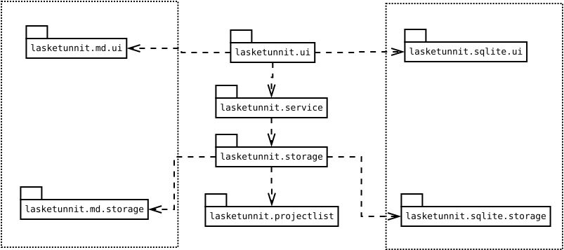

# Arkkitehtuurikuvaus

## Rakenne

**lasketunnit.md** toteuttaa tuntikirjanpidon tallennuksen md-muodossa siten, että **lasketunnit.md.storage** toteuttaa tiedostoon tallentamisen ja tiedostosta lukemisen ja **lasketunnit.md.ui** tallennusjärjestelmästä riippuvaisen osan käyttöliittymästä (tiedoston valitsemisen). Jos ohjelmaan lisättäisiin esim. tuki Google Kalenteriin tallentamiseen, lisättäisiin ohjelmaan pakkaukset **lasketunnit.gcal.storage** ja **lasketunnit.gcal.ui**, jotka rekisteröitäisiin käyttöön **lasktunnit.ui.LaskeTunnitApplication**-luokan **registerComponents()**-metodissa - muutoksia muualla koodissa ei tarvittaisi.

**lasketunnit.ui** toteuttaa JavaFX-käyttöliittymän.

**lasketunnit.service** toteuttaa ohjelmalogiikan ja **lasketunnit.storage** tarjoaa ohjelmalogiikalle yksinkertaisen rajapinnan tiedon pysyväissäilytykseen. Projektien luetteloiden tallentaminen on toteutettu **lasketunnit.projectlist** -pakkaukseen.

## Luokkakaavio

## Toiminnallisuuksia

# Uuden tehtävän lisääminen

Kun käyttäjä valitsee valikosta Tehtävä > Lisää, etenee sovelluksen kontrollilogiikka seuraavasti:

Funktio exec() näyttää dialogin ja odottaa, että käyttäjä täyttää sen.

Kun tehtävä on lisätty, päivitetään käyttöliittymä.

