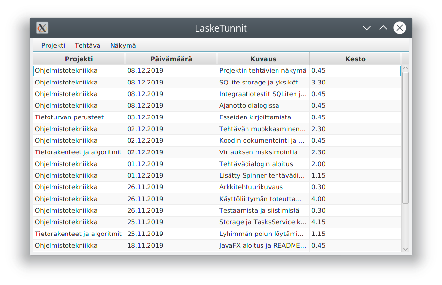

# Käyttöohje

Lataa tiedosto [lasketunnit.jar](https://github.com/artoh/ot-harjoitustyo/releases/download/v1.0/lasketunnit.jar)

## Konfigurointi

Ohjelmaa ei välttämättä tarvitse konfiguroida.

Jos ympäristömuuttuja **LASKETUNNIT_PATH** on määritelty, sijoittaa ohjelma kirjanpitojen luettelon *lasketunnit.ini* sekä tietokantatiedoston *lasketunnit.sql* ympäristömuuttujan määrittelemään hakemistoon. Jos ympäristömuuttujaa ei ole määritelty, tiedostot sijoitetaan ohjelman käynnistyhakemistoon.

## Ohjelman käynnistäminen

Ohjelma käynnistetään komennolla

```
java -jar lasketunnit.jar
```

## Ohjelman näkymät
Näytettävä näkymä valitaan *Näkymä*-valikosta

### Tehtävät-näkymä



Tehtävät-näkymässä näytetään kaikki eri projektien tehtävät.

### Projektit-näkymä


Projektit-näkymässä näytetään projektit ja projekteihin käytetty aika.

### Projektin tehtävät -näkymä


Tähän näkymään pääsee ensin valitsemalla *Projektit*-näkymässä jonkin projektin ja valitsemalla sitten valikosta *Näkymät | Projektin tehtävät*. Näkymässä näytetään valittuun projektiin kuuluvat tehtävät.

## Projektien lisääminen ja poistaminen

*Projekti | Avaa ja tuo | Markdown-tiedosto* -valinnalla pääset lisäämään seurantaan olemassa olevan Markdown-tiedoston. Huomaathan, että ohjelma on tarkka tiedoston muodosta, ja edellyttää täydellisiä päivämääriä muodossa 31.12.2019. Valittuasi tiedoston sinulta kysytään vielä *Projektin nimeä*.

*Projekti | Luo uusi* -valikosta pääset lisäämään uuden projektin. Voit valita, tallennetaanko kirjanpito *Markdown-tiedostoon* vai *ohjelman omaan tietokantatiedostoon*.

*Projekti | Poista seurannasta* poistaa valitun projektin ohjelmasta, mutta ei tuhoa kirjanpitoa tiedostosta. *Projekti | Poista projektin kirjanpito* tuhoaa lisäksi valitun projektin tuntikirjanpidon pysyvästi.

##  Tehtävien lisääminen

Valitse *Tehtävä | Lisää*


Valitse projekti ja päivämäärä (kalenteripainikkeella) sekä syötä tehtävän kuvaus ja kesto.

Painamalla *Ota aikaa* -painiketta voit mitata taustalla tehtävään kuluvaa aikaa. Voit keskeyttää ajanoton painamalla uudelleen *Ota aikaa* -painiketta.

*Ok*-painike tallentaa tehtävän.

## Tehtävien muokkaaminen

Valitsemalla luettelosta tehtävän tulee valikkovalinta *Tehtävä | Muokkaa* aktiiviseksi.

Saat samanlaisen valintataulun kuin uutta tehtävää luotaessa. *Ok*-painike tallentaa muutokset.
