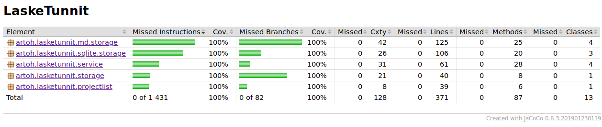

# Testausdokumentti

Ohjelmaa on testattu sekä automaattisin yksikkö/integraatiotestein JUnitilla että manuaalisin järjestelmätason testein. Käyttöliittymä on testattu ainoastaan manuaalisesti.

## Yksikkö- ja integraatiotestaus

Ohjelmaa on koodattu testausvetoisesti niin, että kehitettävälle osalle on samanaikaisesti laadittu JUnit-testit. Luokkien testeihin on liitetty integraation testaamista sitä mukaan, kun testattavat luokat välttämättömästi liittyvät toisiinsa.

Keskeisiä integraatiotestejä ovat [StoragesTest](https://github.com/artoh/ot-harjoitustyo/blob/master/LaskeTunnit/src/test/java/artoh/lasketunnit/storage/StoragesTest.java), [TasksServiceTest](https://github.com/artoh/ot-harjoitustyo/blob/master/LaskeTunnit/src/test/java/artoh/lasketunnit/service/TasksServiceTest.java) sekä sql-tuen lisäämisen jälkeinen [SqliteIntegrationTest](https://github.com/artoh/ot-harjoitustyo/blob/master/LaskeTunnit/src/test/java/artoh/lasketunnit/sqlite/storage/SqliteIntegrationTest.java).

Testit kirjoittavat tiedostoja /tmp-hakemistoon, ja testit tarkastelevat näiden tallennettujen tiedostojen oikeellisuutta. Virhetilanteita on simuloitu mm. puuttuvilla tiedostonnimillä, kesken ohjelman suoritusta poistetuilla tietokantatauluilla sekä (ehkä vähän vaarallisesti) yrittämällä poistaa /etc/hostname -tiedostoa, johon käyttäjällä ei toivottavasti ole oikeuksia.

### Testauskattavuus

Käyttöliittymäkerrosta lukuunottamatta sovelluksen testikattavuus on 100 %.

## Järjestelmätestaus

Sovelluksen järjestelmätestaus on suoritettu manuaalisesti.

Kaikki määrittelydokumentin ja käyttöohjeen toiminnallisuudet on käyty läpi. Syötteinä on kokeiltu myös tyhjiä ja epäkelpoja syötteiden arvoja (siinä määrin kun käyttöliittymä mahdollistaa kelvottomat syötteet).

# Sovellukseen jääneet laatuongelmat

Testejä ei ole siistitty/refaktoritu, eikä erottelu yksikkötesteihin ja integraatiotesteihin oikein käy ilmi ohjelmasta.

Ohjelma ei anna käyttöliittymässä virheilmoitusta tilanteessa, jossa tallentaminen epäonnistuu esimerkiksi tietokannan vioittumisen takia.
